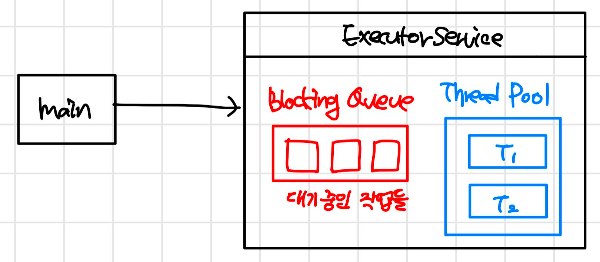

# Concurrent
### concurrent programming
- Concurrent software
    - 동시에 여러 작업을 할 수 있는 소프트웨어
    - 힌 프로세스 안에서도 여러가지 작업들이 동작한다.
- 자바에서 지원하는 Concurrent programming
    - 멀티 프로세스
    - 멀티 스레드

### 멀티 스레드
- 호출 순서와 상관 없이 먼저 처리된 순서대로 스레드가 실행된다. 
1. Thread 생성하기 
    ```java
    public static void main(String[] args) {
        MyThread myThread = new MyThread();
        myThread.start();
        System.out.println(Thread.currentThread().getName()); // 메인 스레드
    }
    // 1. 스레드 상속받아서 만들기
    static class MyThread extends Thread {
        @Override
        public void run() {
            System.out.println("Hello : " + Thread.currentThread().getName());
        }
    }
    ```
2. Runnable
    ```java
        public static void main(String[] args) {
        System.out.println(Thread.currentThread().getName()); // 메인 스레드
            // 2. Runnable
            Thread thread = new Thread(()-> {
                System.out.println("Thread : " + Thread.currentThread().getName());
            });
            thread.start();
        }
    ```
### 스레드의 주요 기능
- sleep : 현재 스레드 대기시키기
    - 다른 스레드에 리소스를 슬 수 있는 우선권이 간다.
    - 다른 스레드 먼저 작업
    ```java
    Thread thread = new Thread(()-> {
        try {
            Thread.sleep(1000L);
        } catch (InterruptedException e) {
            e.printStackTrace(); // 자는 동안에 누가 깨우면 이 안에 들어온다. 
        }
        System.out.println("Thread : " + Thread.currentThread().getName());
    });
    ```
- interrupt : 다른 스레드를 깨우는 방법
    - 다른 스레드를 종료시킬 수 있는 방법은 없고, interrupt했을 때의 동작을 정의할 수 있다.
    ```java
    Thread thread = new Thread(()-> {
        while(true) {
            System.out.println("Thread : " + Thread.currentThread().getName());
            try {
                Thread.sleep(1000L);
            } catch (InterruptedException e) {
                System.out.println("interrupted");
                return; 
            }
        }
    });
    thread.start();
    Thread.sleep(1500L);
    thread.interrupt(); 
    ```
- join : 다른 스레드 기다리기
    - A가 B를 기다리고 있는데, C가 B를 interrupt한 상황 -> InterruptException이 발생한다. 
    
### Executors
- 스레드를 만들고, 관리하고, 작업을 처리하고, 실행하는 일련의 작업을 excutor가 한다.
  - 스레드 만들기 : 어플리케이션이 사용할 풀을 만들어 사용한다.
  - 스레드 관리 : 스레드 생명 주기를 관리한다. 
  - 작업처리 및 실행 : 스레드로 실행할 작업을 제공할 수 있는 api를 제공한다.
- ExecutorService
  - ExecutorService는 작업 처리하고 나면 다른 작업이 들어올 때까지 계속 대기 -> 프로세스가 죽지 않는다.
  - executorService.shutdown() : graceful shutdown 현재 진행중인 작업은 끝가지 마치고 종료
  - executorService.shutdownNow() : 지금 돌고 있는거 상관 없이 바로 종료
- singleThreadExecutor
  - 스레드를 하나만 사용하는 Executor
```java
ExecutorService executorService = Executors.newSingleThreadExecutor();
executorService.submit(()->{
    System.out.println("Thread " + Thread.currentThread().getName());
});
executorService.shutdown();
```
- ThreadPool
  - 스레드 여러개 생성, 알아서 작업을 나누고 처리한다.
    ```java
    public static void main(String[] args) {
        ExecutorService executorService = Executors.newFixedThreadPool(2);
        executorService.submit(getRunnable("The "));
        executorService.submit(getRunnable("Java "));
        executorService.submit(getRunnable("Thread "));
        executorService.submit(getRunnable("Executor "));
    
        executorService.shutdown();
    }
    private static Runnable getRunnable(String message) {
        return () -> System.out.println(message + Thread.currentThread().getName());
    }
    ```
  - 아래와 같은 구조로 Thread Pool에서 아직 처리하지 못한 작업들이 Blocking Queue에 대기하고 있다. 
  
- ScheduledExecutor
  - 작업에 딜레이와 주기를 줄 수 있다.
  ```java
  ScheduledExecutorService executorService = Executors.newSingleThreadScheduledExecutor();
  // 3초 기다렸다가 실행 
  executorService.schedule(getRunnable("Hello"), 3, TimeUnit.SECONDS);
  
  // 1초 기다렸다가 2초에 한 번씩 실행 
  executorService.scheduleAtFixedRate(getRunnable("Hello"), 1, 2, TimeUnit.SECONDS);
  ```
### Callable, Future
### CompletableFuture