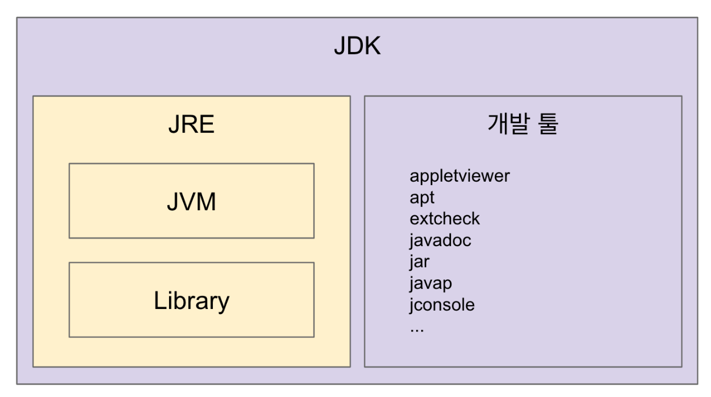

# JVM
### JVM, JRE, JDK 비교

- JVM
    - 자바 가상 머신
        - 가상머신은 운영체제와 응용 프로그램 사이에서 작동하는 프로그램으로, 가상머신을 설치하면 응용 프로그램이 모두 동일한 환경에서 작동하는 것 처럼 보인다.
        - 하나의 코드만 만들면 여러 운영체제에서 똑같이 실행할 수 있다.
    - 자바 바이트 코드를 어떻게 실행할지에 대한 표준 스펙
    - 자바 바이트 코드(.class 파일)를 OS에 특화된 코드로 변환(인터프리터와 JIT 컴파일러)하여 실행한다.
    - 자바가 아닌 프로그래밍 언어로 코딩하더라고 컴파일했을 때 class파일, java파일을 만들어주기만 한다면 JVM을 사용할 수 있다. (ex. Kotlin, Scala, JRuby, ...)
    - 구현체는 다양하고, 플랫폼에 종속적이다.
    - JVM의 최소 배포단위가 JRE
- JRE
    - JVM + Library
    - 목적 : 자바 애플리케이션을 실행하는 것
    - JVM과 핵심 라이브러리 및 자바 런타임 환경에서 사용하는 프로퍼티 세팅이나 리소스 파일을 가지고 있다.
    - 개발 관련 도구는 포함하지 않는다. (그건 JDK에서 제공)
- JDK
    - JRE + 개발에 필요할 툴
    - 소스 코드를 작성할 때 사용하는 자바 언어는 플랫폼에 독립적.
    - 오라클은 자바 11부터는 JDK만 제공하며 JRE를 따로 제공하지 않는다.
    - Write Once Run Anywhere
- Java
    - 자바는 프로그래밍 언어
### JVM 구조
클래스 로더가 읽음 → 메모리에 적절히 배치 → 실행 엔진이 실행 

- 클래스 로더 시스템
    - 로딩 : 클래스를 읽어오는 과정
    - 링크 : 레퍼런스를 연결하는 과정
    - 초기화 : static값들 초기화 및 변수에 할당
- 메모리
    - 메소드 : 클래스 수준의 정보를 저장 (클래스 이름, 부모 클래스 이름, 메소드, 변수)
    - 힙 : 객체를 저장
    - 스택 : 스레드 마다 런타임 스택을 만들고, 그 안에 메소드 호출을 스택 프레임이라 부르는 블럭으로 쌓는다. 쓰레드 종료하면 런타임 스택도 사라진다.
    - PC 레지스터 : 스레드마다 생성된다. 스레드 내 현재 실행할 스택 프레임을 가리키는 포인터
    - 네이티브 메소드 스택 : 네이티브 메소드 호출할 때 사용
      
      (네이티브 메소드 : 네이티브 키워드가 붙어있고, 구현을 자바가 아닌 C나 C++로 한 메소드)

  → 힙과 메소드는 모든 영역에서 공유할 수 있는 자원이다. 나머지 스택, PC, 네이티브 메소드 스택은 하나의 스레드에 국한된다.
    
- 네이티브 메소드 인터페이스(JNI)
- 네이티브 메소드 라이브러리
- 실행 엔진
    - 인터프리터 : 바이트 코드 한줄 씩 실행 → 바이트 코드를 네이티브 코드로 한 줄씩 컴파일
    - JIT 컴파일러 : 인터프리터가 반복되는 코드를 발견하면 JIT컴파일러로 반복되는 코드를 모두 네이티브 코드라 바꿔둔다.
    - GC(Garbage Collector) : 더 이상 참조되지 않는 객체를 모아서 정리한다.
    
### 클래스로더
로딩, 링크, 초기화 순으로 진행된다.
1. 로딩
    - 클래스 로더가 .class 파일을 읽고 그 내용에 따라 적절한 바이너리 데이터를 만들고 “메소드” 영역에 저장
    - 이때 메소드 영역에 저장하는 데이터
        - FQCN
        - 클래스 | 인터페이스 | 이늄
        - 메소드와 변수
    - 로딩이 끝나면 해당 클래스 타입의 Class 객체를 생성하여 힙에 저장 (→ 공유)
2. 링크
    - Verify, Prepare, Reolve(optional) 세 단계로 나눠져 있다.
    - Verify: .class 파일 형식이 유효한지 체크한다.
    - Preparation: 클래스 변수(static 변수)와 기본값에 필요한 메모리를 준비해둔다.
    - Resolve: 심볼릭 메모리 레퍼런스를 메소드 영역에 있는 실제 레퍼런스로 교체한다. (optional)
3. 초기화
    - 준비해둔 메모리 영역에 static값을 할당한다.
    
### 클래스로더의 종류
```java
public class App {
    public static void main(String[] args) {
        ClassLoader classLoader = App.class.getClassLoader();
        System.out.println(classLoader); // 애플리케이션 클래스 로더
        System.out.println(classLoader.getParent()); // 플랫폼 클래스 로더
        System.out.println(classLoader.getParent().getParent()); // 부트 스트랩 클래스 로더 - 네이티브로 구현되어 있어서 출력할 수 없다.
    }
}
```
- 부트 스트랩 클래스 로더 - JAVA_HOME\lib에 있는 코어 자바 API를 제공한다. 최상위 우선순위를 가진 클래스 로더
- 플랫폼 클래스로더 - JAVA_HOME\lib\ext 폴더 또는 java.ext.dirs 시스템 변수에 해당하는 위치에 있는 클래스를 읽는다.
- 애플리케이션 클래스로더 - 애플리케이션 클래스패스(애플리케이션 실행할 때 주는 -classpath 옵션 또는 java.class.path 환경 변수의 값에 해당하는 위치)에서 클래스를 읽는다.
- 우리가 작성한 코드는 애플리케이션 클래스로더가 읽게 된다.
- 클래스 로더가 데이터를 읽는 원리 : 가장 부모(부트 스트랩 클래스로더)에 부탁 -(못 읽어)→ 플랫폼 클래스로더-(못읽어)→ 애플리케이션 클래스 로더

  만약 애플리케이션 클래스로더도 읽지 못하면 ClassNotFoundException

### 바이트코드(.class) 조작
- 이미 만든 객체에 내 코드를 삽입하고 싶을 때 사용한다.
- 원본은 그대로 두면서 코드를 삽입할 수 있는 기술이다.
- 구체적으로 아래와 같은 경우들이 있다.
    - 프로그램 분석
        - 코드에서 버그 찾는 툴
        - 코드 복잡도 계산
    - 클래스 파일 생성
        - 프록시 만들기 → 스프링 aop에서 사용됨
        - 특정 api호출 접근 제한 (추가적인 로직 넣기)
        - 스칼라 같은 언어의 컴파일러 - JVM위에서 돌아갈 수 있게
    - 프로파일러 (성능 분석)
    - 최적화
    - 로깅
    - 스프링이 컴포넌트 스캔을 하는 방법 (asm)
        - 컴포넌트 스캔으로 빈으로 등록할 후보 클래스 정보를 찾는데 사용
        - ClassPathScanningCandidateComponentProvider -> SimpleMetadataReader
        - ClassReader와 Visitor 사용해서 클래스에 있는 메타 정보를 읽어온다.
